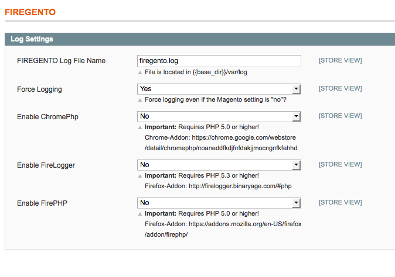
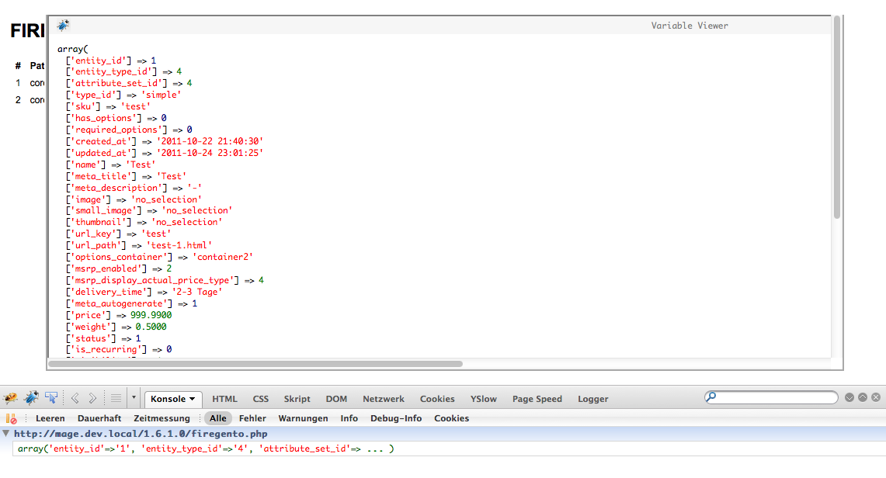
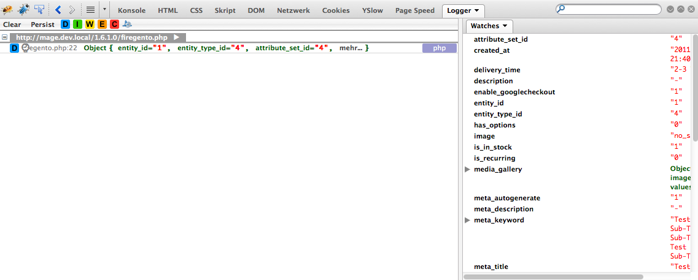
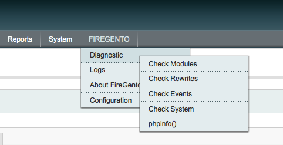
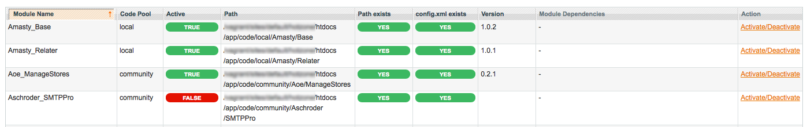
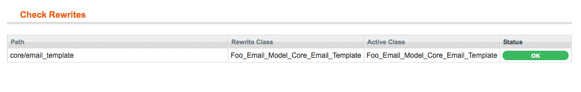
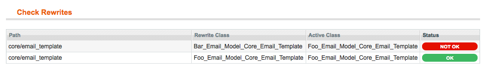
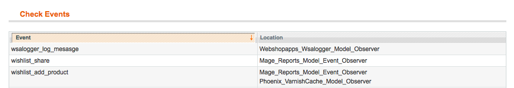
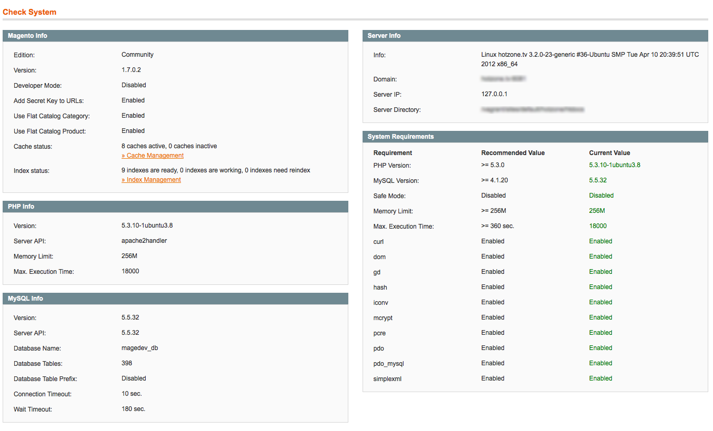
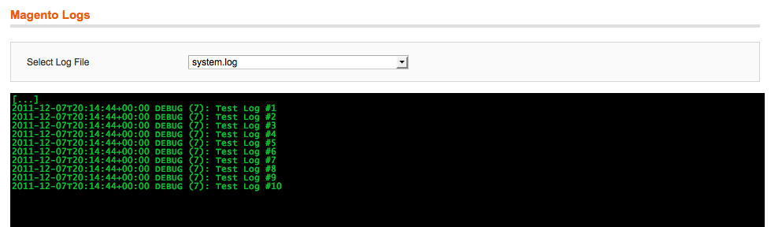

FireGento_Debug
<!-- ALL-CONTRIBUTORS-BADGE:START - Do not remove or modify this section -->
[](#contributors-)
<!-- ALL-CONTRIBUTORS-BADGE:END -->
=====================
This extension provides some debbuging functionality for Magento.

Facts
-----
- version: 1.5.0
- [extension on GitHub](https://github.com/firegento/firegento)


Description
-----------
This extension provides some debugging functionality for Magento.
This includes:

- List all installed modules incl. their dependencies in the Magento backend
- Activate/Deactivate non-core modules via the Magento backend
- Check all installed modules for rewrite conflicts
- Show all triggered events/observers
- Show all log files in the Magento backend in "terminal-like" style
- Show detailed system information in the backend
- Provide logging interfaces for [ChromePhp](http://www.chromephp.com/), [FirePHP](http://www.firephp.org/) and [Firelogger](http://firelogger.binaryage.com/)

## Installation
Install the files using one of the following methods:
### Via modman
- Install [modman](https://github.com/colinmollenhour/modman)
- Use the command from your Magento installation folder: `modman clone https://github.com/firegento/firegento-debug.git`

### Via composer
- Install [composer](http://getcomposer.org/download/)
- Create a composer.json into your project like the following sample:

```json
{
    ...
    "require": {
        "firegento/debug":"*"
    },
    "repositories": [
	    {
            "type": "composer",
            "url": "http://packages.firegento.com"
        }
    ],
    "extra":{
        "magento-root-dir": "./"
    }
}

```

- Then from your composer.json folder: `php composer.phar install` or `composer install`

### Manually
You can copy the files from the 'src' folder of this repository to the same folders of your installation

Once the files are installed:

- Clear the cache, logout from the admin panel and then login again.

 A new Menu item named "**FIREGENTO**" will appear in the admin area
 
## Logging functionality
This module exposes some logging functionality for use in your own extensions.

You can:

- log data to a file that you specify in the configuration
- log data to the browser using either: [ChromePhp](http://www.chromephp.com/), [FirePHP](http://www.firephp.org/) or [Firelogger](http://firelogger.binaryage.com/)

The extension can be configured under FIREGENTO > Configuration



Here you can change the name of the log file which will be written (by default firegento.log) if you select "Force Logging" then the log file will be written to irrespective of the the configuration setting to enable logging "Developer > Log Settings > Enabled".

### Usage

#### Log information to file:

```
$product = Mage::getModel('catalog/product');
Mage::helper('firegento/log')->log($product->debug());
```
This statement will take the output of `$product->debug()` and log it to the configured file.  

There is also a utilty method available `debug()` you can use this method to log large objects such as sales/quote, sales/order or other objects which are instances of Varien_Object internally the debug() method of this object will be called, and the output logged to using `FireGento_Debug_Helper_Log::log()`

```
$object = Mage::getModel('sales/order')->load(XXX);
Mage::helper('firegento/log')->debug($object);
```

#### Log information to the browser
It is also possible to send the output of the logging to the browser and have it displayed by [ChromePhp](http://www.chromephp.com/), [FirePHP](http://www.firephp.org/) or [Firelogger](http://firelogger.binaryage.com/) in order to do this, you must make sure that you have enabled the appropriate option in the configuration, and then you can simply use one of the following statements:

```
$product = Mage::getModel('catalog/product');

// log to chromephp
Mage::helper('firegento/log')->chromephp($product->debug());

// log to firelogger
Mage::helper('firegento/log')->firelogger($product->debug());

// log to firephp
Mage::helper('firegento/log')->firephp($product->debug());
```
You will then see something like these images in the browser extensions:





## Admin Functionality
The functionality can be accessed via the "**FIREGENTO**" menu item.



### Diagnostic > Check Modules
Here all the installed modules including their dependencies are listed. 


You will see:

- The modules Namespace and name
- the code pool to which it belongs
- the current status
- the path to the extension in the filesystem
- if the path exists or not
- if the config.xml exists
- the version of the extension
- any dependencies defined for the extension

Non system extensions can be activated/decativated by clicking on the link in the Action column.

### Diagnostic > Check Rewrites

A convenient overview of rewritten classes is displayed here.
When a classpath is overwritten by an extension, you will see the name of the class which overrides it, and the name of the active class for that classpath. In the case of a rewrite conflict the status column displays a red "not ok" status. You will see that the Active class differs from the rewrite class.
 
 

In the image above the classpath core/email_template is succesfully overwritten.


Here there is a rewrite conflict, and the rewrite which is not active is shown with a red "not ok" status

there is a file called firegento.php which you can install in the root of your magento instance, this allows you to check the status of rewrites without installing the whole Firegento_Debug extension.

### Diagnostic > Check Events
This allows you to see all events in your system and which observers are listening for them. When more than one observer is bound to the event, then they are listed under each other, in the column "Location"



### Diagnostic > Check System
Here you will see information about the system, which is divided into 5 areas:

- Magento Information
- PHP Information
- MySQL Information
- Server Information
- System Requirements



### Diagnostic > phpinfo()
The output of the phpinfo() function is displayed here


### Logs
The log viewer allows you to select a log file to open, you will be able to see in real time in a console like window as entries are written.




Requirements
------------
- PHP >= 5.3.0

Compatibility
-------------
- Magento >= 1.5
- Versions below are not actively tested but should work without problems

Support
-------
If you have any issues with this extension, open an issue on [GitHub](https://github.com/firegento/firegento-debug/issues).

Contribution
------------
Any contribution is highly appreciated. The best way to contribute code is to open a [pull request on GitHub](https://help.github.com/articles/using-pull-requests).

Developer
---------
- Website: [http://firegento.com](http://firegento.com)
- Twitter: [@firegento](https://twitter.com/firegento)

Licence
-------
[GNU General Public License, version 3 (GPLv3)](http://opensource.org/licenses/gpl-3.0)

Copyright
---------
(c) 2013 FireGento

## Contributors ✨

Thanks goes to these wonderful people ([emoji key](https://allcontributors.org/docs/en/emoji-key)):

<!-- ALL-CONTRIBUTORS-LIST:START - Do not remove or modify this section -->
<!-- prettier-ignore-start -->
<!-- markdownlint-disable -->
<table>
  <tr>
    <td align="center"><a href="https://rouven.io/"><br /><sub><b>Rouven Alexander Rieker</b></sub></a><br /><a href="https://github.com/firegento/firegento-debug/commits?author=therouv" title="Code">💻</a></td>
    <td align="center"><a href="http://www.webguys.de/"><br /><sub><b>Tobias Vogt</b></sub></a><br /><a href="https://github.com/firegento/firegento-debug/commits?author=tobi-pb" title="Code">💻</a></td>
    <td align="center"><a href="https://github.com/pixelhed"><br /><sub><b>Andre Flitsch</b></sub></a><br /><a href="https://github.com/firegento/firegento-debug/commits?author=pixelhed" title="Code">💻</a></td>
  </tr>
</table>

<!-- markdownlint-enable -->
<!-- prettier-ignore-end -->
<!-- ALL-CONTRIBUTORS-LIST:END -->

This project follows the [all-contributors](https://github.com/all-contributors/all-contributors) specification. Contributions of any kind welcome!